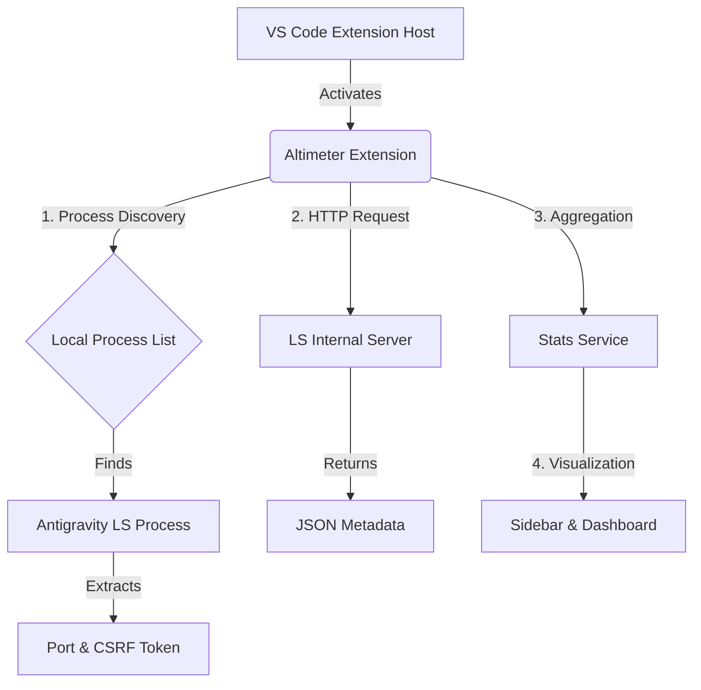

# Altimeter Architecture

Altimeter is a VS Code extension designed to monitor token usage by the Antigravity Language Server. It operates by inspecting the local process list to find the running Language Server, connecting to its internal HTTP server, and visualizing the data.

## High-Level Data Flow



## Core Components

### 1. Process Discovery (`src/core/strategies.ts`)
Altimeter uses platform-specific strategies to find the Antigravity Language Server process.
- **Windows**: Uses PowerShell (`Get-CimInstance Win32_Process`) to inspect command lines.
- **Unix (macOS/Linux)**: Uses `ps` and `lsof`/`netstat`/`ss` to find the process and listening ports.

It looks for specific command-line arguments:
- `--extension_server_port`: The port the internal server is listening on.
- `--csrf_token`: The token required to authenticate requests.

### 2. Data Retrieval (`src/core/LSClient.ts`)
Once the connection details are found, `LSClient` polls the server (default every 1 second). It fetches the `/debug/metadata` endpoint, which contains a history of recent LLM interactions, including token usage (prompt, response, cache).

### 3. Statistics Engine (`src/services/StatsService.ts`)
Raw metadata is processed by `StatsService`.
- **Aggregation**: Sums up input, output, and cache tokens.
- **Model Breakdown**: Categorizes usage by model (e.g., Gemini 1.5 Pro, Flash).
- **Session Tracking**: Maintains a running total for the current VS Code session.

### 4. UI / Panels (`src/panels/`)
Altimeter provides two main views:
- **Sidebar**: A lightweight view showing current session totals.
- **Dashboard (`StatisticsPanel.ts`)**: A full-width webview using **Chart.js** to display:
    - Token distribution (Input vs. Output vs. Cache).
    - Daily usage logs (persisted in global state).

## Project Structure

```
src/
├── core/           # Core logic for process discovery and LS connection
│   ├── strategies.ts   # Platform-specific process finding
│   └── LSClient.ts     # HTTP client for LS communication
├── panels/         # WebView panels (Dashboard)
├── services/       # Business logic (Stats aggregation, Data formatting)
├── shared/         # Shared types and utilities
└── test/           # Unit and integration tests
```

## Key Technologies
- **TypeScript**: Core language.
- **VS Code Extension API**: For integration with the editor.
- **Chart.js**: For visualizing token statistics.
- **PowerShell / Bash**: For low-level process inspection.
